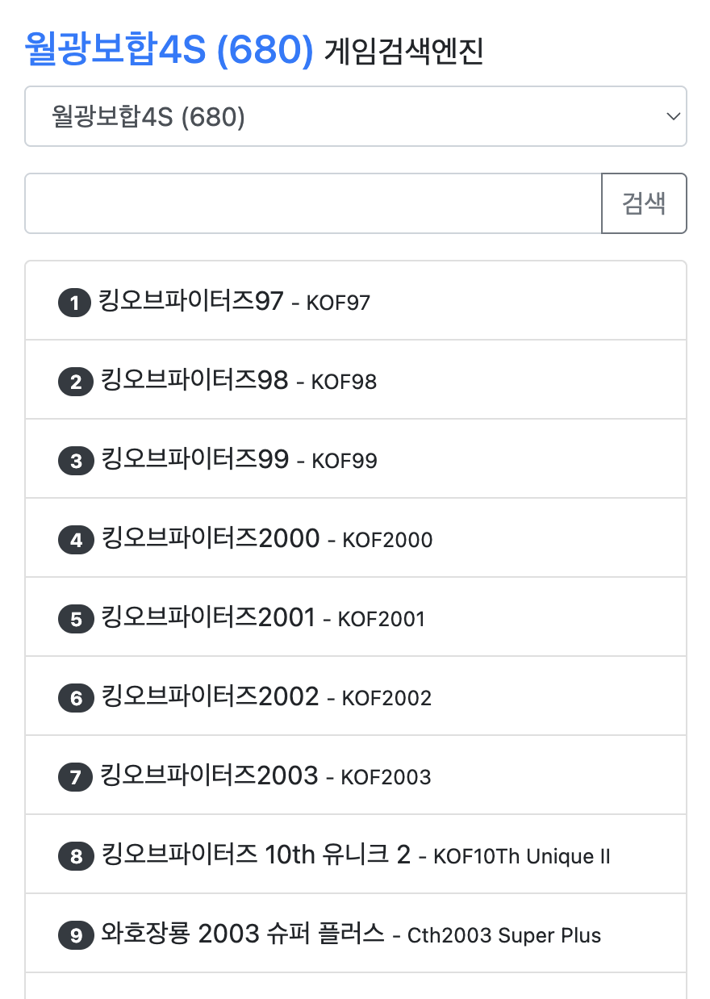

# 월광보합 게임번호찾기

[game.gslump.com](https://game.gslump.com) 서비스의 소스코드입니다.
월광보합 시리즈(4S, H4S, 5S, XS, 7) 게임번호찾기 서비스로, 소스를 공개합니다.



## 사용법

1. [game.gslump.com](https://game.gslump.com) 접속
2. 기기 모델 선택
3. 게임 이름 검색 → 번호 확인

검색 결과는 URL 파라미터(`?model=...&q=...`)로 공유할 수 있습니다.

## 검색 기능

| 검색 유형 | 예시 | 설명 |
|---|---|---|
| 한글 직접 입력 | `킹오브` | 대소문자 무시, 공백 무시 |
| 자모 분해 검색 | `파잍` → `파이터` | 조합 중인 글자도 완성형과 매칭 |
| 초성 검색 | `ㅋㅇㅂ` → `킹오브파이터즈` | 한글 초성만으로 검색 |
| 영문 직접 입력 | `king` | 대소문자·공백 무시 (`thelast` → `The Last`) |
| 영문 이니셜 검색 | `kof` → `King of Fighters` | 각 단어 첫 글자로 검색 |

- 타이핑하는 즉시 실시간 필터링 (엔터/버튼으로도 검색 가능)
- 매칭된 글자는 파란색으로 하이라이트 (가장 긴 매치 우선 채택)

## 개발 / 데이터 기여

### 파일 구조

```
template.html   UI 템플릿 — 편집 대상
games.csv       게임 데이터 — 편집 대상
models.csv      기기 모델 목록 — 편집 대상
build.py        빌드 스크립트
index.html      빌드 산출물 — 직접 편집 금지
```

### 빌드

```bash
python3 build.py
```

`games.csv`와 `models.csv`를 읽어 `template.html`에 데이터를 인라인 삽입한 `index.html`을 생성합니다.

### games.csv 포맷

```
model,id,title,title_ko
4S-680,1,The King of Fighters '97,킹오브파이터즈97
```

| 컬럼 | 설명 |
|---|---|
| `model` | 기기 모델 코드 |
| `id` | 게임 번호 (정수) |
| `title` | 영문 타이틀 (없으면 빈 값) |
| `title_ko` | 한글 타이틀 (없으면 빈 값) |

> 검색용 파생 필드(`jamo`, `chosung`, `initials`)는 `build.py`가 자동으로 계산합니다. CSV에 추가할 필요 없습니다.

### models.csv 포맷

```
model,label
4S-680,월광보합4S (680)
```

| 컬럼 | 설명 |
|---|---|
| `model` | 기기 모델 코드 (`games.csv`와 일치해야 함) |
| `label` | 셀렉트박스에 표시할 이름 |

> `build.py`는 두 CSV의 모델 코드가 일치하는지 정합성 검사를 수행합니다.

### CSV 인코딩

두 CSV 파일 모두 **UTF-8**로 저장해야 합니다.
Excel에서 편집 시 "다른 이름으로 저장 → CSV UTF-8(쉼표로 분리)"을 선택하세요. 일반 "CSV"는 CP949로 저장되어 한글이 깨집니다.
